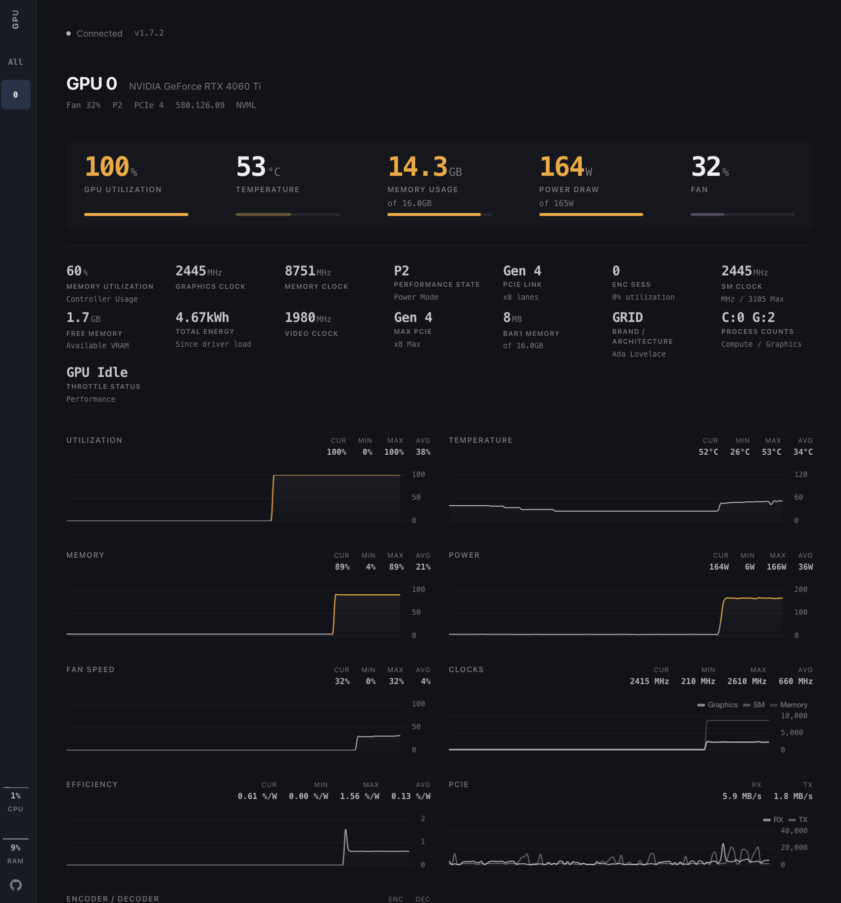

<div align="center">

# GPU Hot

Real-time NVIDIA GPU monitoring dashboard. Lightweight, web-based, and self-hosted.

[](https://www.python.org/)
[](https://www.docker.com/)
[](LICENSE)
[](https://www.nvidia.com/)



<p>
<a href="https://psalias2006.github.io/gpu-hot/demo.html">

</a>
</p>

</div>

---

## Usage

Monitor a single machine or an entire cluster with the same Docker image.

**Single machine:**
```bash
docker run -d --gpus all -p 1312:1312 ghcr.io/psalias2006/gpu-hot:latest
```

**Multiple machines:**
```bash
# On each GPU server
docker run -d --gpus all -p 1312:1312 -e NODE_NAME=$(hostname) ghcr.io/psalias2006/gpu-hot:latest

# On a hub machine (no GPU required)
docker run -d -p 1312:1312 -e GPU_HOT_MODE=hub -e NODE_URLS=http://server1:1312,http://server2:1312,http://server3:1312 ghcr.io/psalias2006/gpu-hot:latest
```

Open `http://localhost:1312`

**Older GPUs:** Add `-e NVIDIA_SMI=true` if metrics don't appear.

**Process monitoring:** Add `--init --pid=host` to see process names. Note: This allows the container to access host process information.

**From source:**
```bash
git clone https://github.com/psalias2006/gpu-hot
cd gpu-hot
docker-compose up --build
```

**Requirements:** Docker + [NVIDIA Container Toolkit](https://docs.nvidia.com/datacenter/cloud-native/container-toolkit/latest/install-guide.html)

---

## Features

- Real-time metrics (sub-second)
- Automatic multi-GPU detection
- Process monitoring (PID, memory usage)
- Historical charts (utilization, temperature, power, clocks)
- System metrics (CPU, RAM)
- Scale from 1 to 100+ GPUs

**Metrics:** Utilization, temperature, memory, power draw, fan speed, clock speeds, PCIe info, P-State, throttle status, encoder/decoder sessions

---

## Configuration

**Environment variables:**
```bash
NVIDIA_VISIBLE_DEVICES=0,1     # Specific GPUs (default: all)
NVIDIA_SMI=true                # Force nvidia-smi mode for older GPUs
GPU_HOT_MODE=hub               # Set to 'hub' for multi-node aggregation (default: single node)
NODE_NAME=gpu-server-1         # Node display name (default: hostname)
NODE_URLS=http://host:1312...  # Comma-separated node URLs (required for hub mode)
UPDATE_INTERVAL=0.5            # Optional. NVML polling interval in seconds (default: 0.5)
NVIDIA_SMI_INTERVAL=2.0        # Optional. nvidia-smi fallback polling interval (default: 2.0)
```

Polling is paused automatically when no clients are connected, so idle CPU usage stays near zero.

**Backend (`core/config.py`):**
```python
PORT = 1312            # Server port
```

---

## API

### HTTP
```bash
GET /              # Dashboard
GET /api/gpu-data  # JSON metrics snapshot
GET /api/version   # Version and update info
```

### WebSocket
```javascript
const ws = new WebSocket('ws://localhost:1312/socket.io/');

ws.onmessage = (event) => {
  const data = JSON.parse(event.data);
  // data.gpus      — per-GPU metrics
  // data.processes  — active GPU processes
  // data.system     — host CPU, RAM, swap, disk, network
};
```

---

## Project Structure

```
gpu-hot/
├── app.py                      # FastAPI server + routes
├── version.py                  # Version info
├── core/
│   ├── config.py               # Configuration
│   ├── monitor.py              # NVML GPU monitoring
│   ├── handlers.py             # WebSocket handlers
│   ├── hub.py                  # Multi-node hub aggregator
│   ├── hub_handlers.py         # Hub WebSocket handlers
│   ├── nvidia_smi_fallback.py  # nvidia-smi fallback for older GPUs
│   └── metrics/
│       ├── collector.py        # Metrics collection
│       └── utils.py            # Metric utilities
├── static/
│   ├── css/
│   │   ├── tokens.css          # Design tokens (colors, spacing)
│   │   ├── layout.css          # Page layout (sidebar, main)
│   │   └── components.css      # UI components (cards, charts)
│   ├── js/
│   │   ├── chart-config.js     # Chart.js configurations
│   │   ├── chart-manager.js    # Chart data + lifecycle
│   │   ├── chart-drawer.js     # Correlation drawer
│   │   ├── gpu-cards.js        # GPU card rendering
│   │   ├── socket-handlers.js  # WebSocket + batched rendering
│   │   ├── ui.js               # Sidebar navigation
│   │   └── app.js              # Init + version check
│   └── favicon.svg
├── templates/index.html
├── Dockerfile
├── docker-compose.yml
└── requirements.txt
```

---

## Troubleshooting

**No GPUs detected:**
```bash
nvidia-smi  # Verify drivers work
docker run --rm --gpus all nvidia/cuda:12.1.0-base-ubuntu22.04 nvidia-smi  # Test Docker GPU access
```

**Hub can't connect to nodes:**
```bash
curl http://node-ip:1312/api/gpu-data  # Test connectivity
sudo ufw allow 1312/tcp                # Check firewall
```

**Performance issues:** Increase `UPDATE_INTERVAL` (env var, seconds — e.g. `-e UPDATE_INTERVAL=2.0`)

---

## Star History

[](https://www.star-history.com/#psalias2006/gpu-hot&type=date&legend=top-left)

## Contributing

PRs welcome. Open an issue for major changes.

## License

MIT - see [LICENSE](LICENSE)
